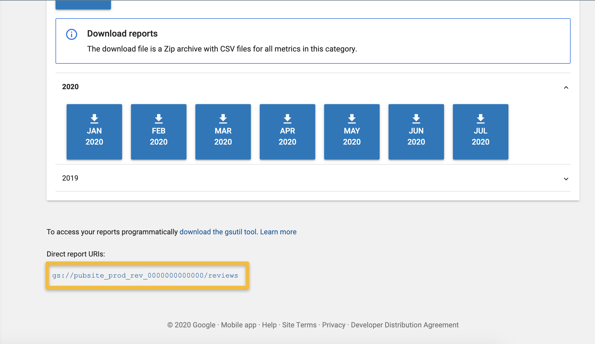

# Download

The google play review download screen isn't very user friendly for batch downloading all your reviews so I put together 
this small repo to explain how to get all your reviews in one nice file.


More information on [how to download monthly reports](https://support.google.com/googleplay/android-developer/answer/6135870?hl=en).

The instructions here assume you're running in a system where you can use bash and that you have python installed.

## 1. Get gcloud and gsutil

First up make sure you have [gsutil installed](https://cloud.google.com/storage/docs/gsutil_install#install).

## 2. Find your bucket url



## 3. Download files

```shell script
mkdir files
gsutil cp 'gs://pubsite_prod_rev_000000000000000/reviews/reviews_<your_bundle_name>*' ./files
```

## 4. Join files

Finally, run the supplied python script to join the files:

```shell script
pipenv install
pipenv run python csv_join.py --directory files > output.csv
```

## troubleshooting

If you get something like this:

```
zsh: no matches found: gs://pubsite_prod_rev....
```

Check so that you have access to the buckets:

```shell script
gsutil ls
```

This may give you:

```
AccessDeniedException: 403 xxxx@gmail.com does not have storage.buckets.list access to the Google Cloud project.
```

In which case you may need to make sure you have logged in properly and your gcloud is configured to the right project.

```shell script
gcloud auth login
```